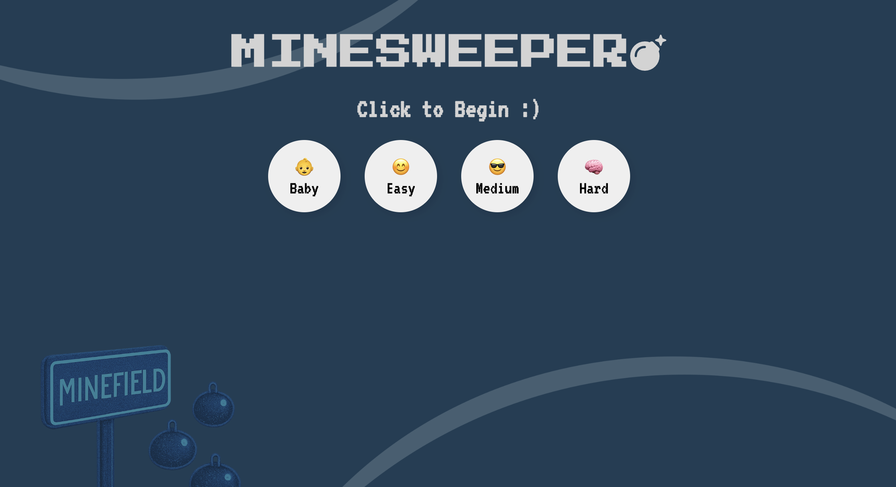
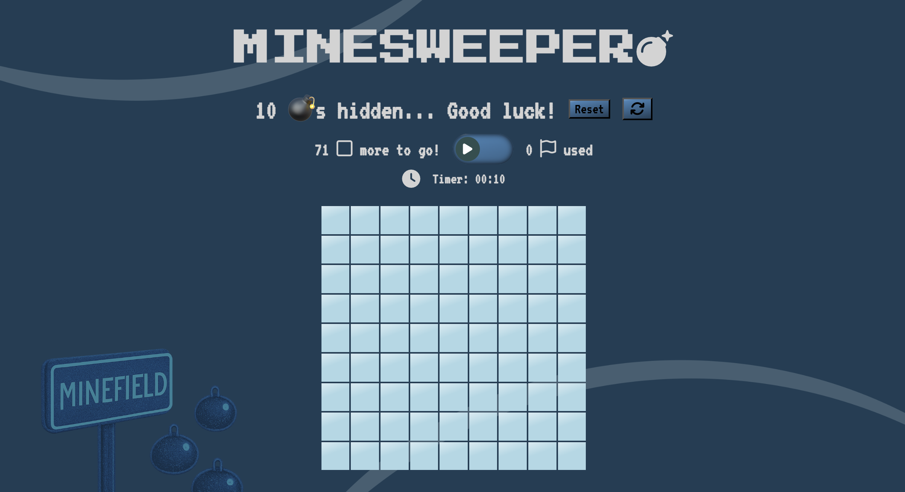

# Simple Minesweeper 💣 Game

## Table of Content

- [Overall](#overall)
- [Pages of the Day](#pages-of-the-game)
- [User Stories](#user-stories)
- [Credits](#credits)

## Overall

### Background

I chose to implement a simple minesweeper game since I enjoyed playing it on the computer decades ago. Decided to go for something that I could then slowly add other additional features.

- There is also the desire to use this a a foundation to build a portfolio of mini games and utils for myself.

### Language utilised

- HTML
- CSS (flex)
- Typescript

### Design pattern used

- MVC with OOP (with FPs in utils)

## Pages of the Game

### Minesweeper Landing Page

### Minesweeper Game PAge

## User Stories

### Beginner User Story:

- [x] User is able to select one of at least 3 buttons of difficulty to decide level of difficulty of the game they want to play
- [x] User is able to obtain a game board "minefield", after selecting the difficulty, to commence gameplay
  - Easy(9x9, 10 bombs (12%)) | Medium(15x15, 40 bombs (17%)) | High (30x30, 180 bombs (20%))
- [x] During gameplay, User can click on the cells on the minefield board to make a move.
- [x] During gameplay, User will be able to know how many bombs there are to be found to understand the progress of the game
- [x] During gameplay, User will be able to know how many remaining cells they need to click to successfully win the game
- [x] During gameplay, User can click on the cell and be informed that this cell would have been clicked to avoid repated clicks on the same cell
  - [x] Good UI when hovering across buttons
- [x] During gameplay, User will know how many bombs are adjacent to the cell (diagonal inclusive) that they have just clicked. Similar to classic minesweeper, this would be indicated via a number on the selected cell.
- [x] When the user clicks on a cell with 0 adjacent bomb-containing cells, the board will automatically and iterateively reveal all adjacent cells to any 0 adjacent bomb-containing cells, so that the user would not need to reclick any cells and help the user further progress the game
- [x] When the user clicks on a bomb-containing cell, the board will reveal all bomb-containing cells and inform the user that the game has ended and they have lost
- [x] When the user clicks on a bomb-containing cell, the board will show where did the user made an error
  - [FAIL on TS] Audio when player clicks on a bomb-containing cell
- [x] When the user manages to reveal all non-bomb-containing cells, the board will reveal all cells and inform the user that the game has ended and they have won
  - [x] Add confetti when winning
- [x] User can re-initialise the game whenever they want -> via Reset Button
- [x] User can regenerate another board of the current difficulty they are playing on whenever they want
- [x] During gameplay, user has the option to utilise flag markers & no. of flags used
  - [x] Format the switch nicely with the stats
  - [x] Make sure switch resets properly after reset!

### Additional User Stories:

- ~~[ ] Refactor table into CSS grid~~
- [x] Minefield can be adjusted to be played on mobile
- [x] Show time taken to Win/Lose

### Personal Additional User Stories:

- [ ] Navbar as a foundation for portfolio building
- [ ] Deploy if possible

### Personal Learning Pointers:

- [x] Check utility of Game Status
- [ ] Refactor 'difficulty' into a class to allow for further difficulty levels to be added
- [ ] See if can do testing
- [ ] Explore if data can be stored on client localCache
- ~~[ ] Explore the use of Sets in minesweeper logic~~

--

## Credits

Features adopted from:

- [Toggle Switch](https://uiverse.io/MuhammadHasann/popular-seahorse-73)
- [Confetti Animation](https://www.youtube.com/watch?v=hq_tKbSzAiY)
